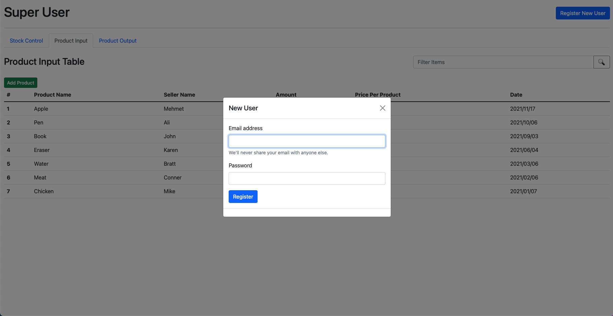
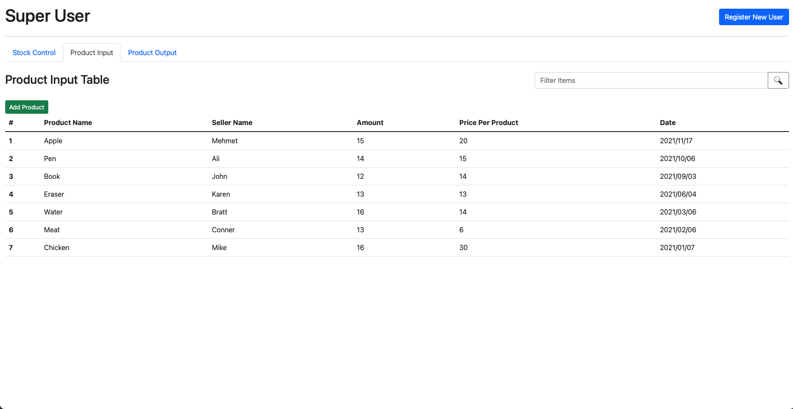
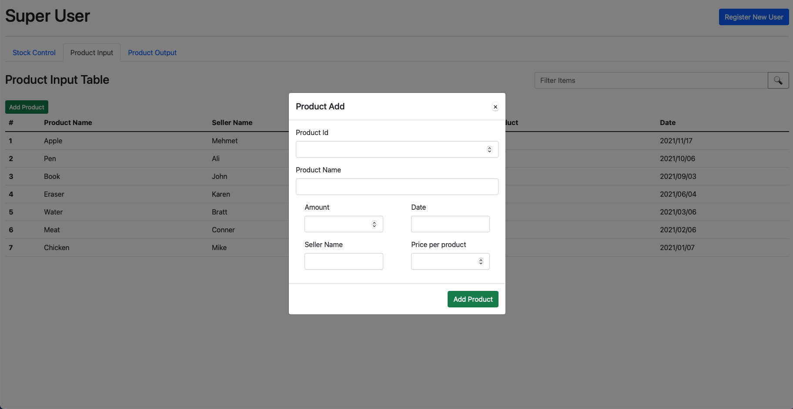

# Market Stock Pricing System
I tried to improve my moduler working in this app
## Used Technologies
- Html-Css-Js
- Bootstrap

## Features
- Login page   
- Adding a new user by admin (no database included)   
- CRUD operations for products      
 
## How to use
1. Download this project to your computer.
2. Open in any code editor.
3. Start index.html
